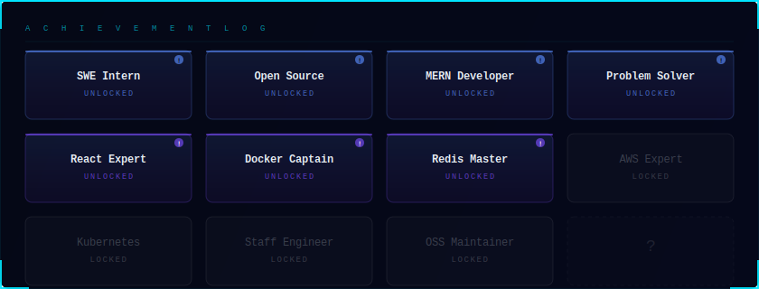

<!--
  ░░░░░░░░░░░░░░░░░░░░░░░░░░░░░░░░░░░░░░░░░░░░░░░░░░░░░░
  ░                                                      ░
  ░   ANJALI SAHU — GitHub Profile README                ░
  ░   Design: Minimalist RPG Dashboard                   ░
  ░                                                      ░
  ░░░░░░░░░░░░░░░░░░░░░░░░░░░░░░░░░░░░░░░░░░░░░░░░░░░░░░
-->

 

<!-- SYSTEM BOOT -->

  

# ANJALI SAHU

**`Software Engineer`** &nbsp;&middot;&nbsp; **`SWE Intern @ AlgoUniversity`** &nbsp;&middot;&nbsp; **`MERN + AI`**

 

&nbsp;
&nbsp;

  

---

<!-- ══════════════════════════════════════════════════════════════════ -->
<!--  01 — CHARACTER                                                   -->
<!-- ══════════════════════════════════════════════════════════════════ -->

 

  

---

<!-- ══════════════════════════════════════════════════════════════════ -->
<!--  02 — CURRENT QUEST                                               -->
<!-- ══════════════════════════════════════════════════════════════════ -->

 

  

---

<!-- ══════════════════════════════════════════════════════════════════ -->
<!--  03 — INVENTORY                                                   -->
<!-- ══════════════════════════════════════════════════════════════════ -->

 

<table>
<tr>
<td align="center" valign="top" width="16.6%">
<b>Languages</b>  

</td>
<td align="center" valign="top" width="16.6%">
<b>Frontend</b>  

</td>
<td align="center" valign="top" width="16.6%">
<b>Backend</b>  

</td>
<td align="center" valign="top" width="16.6%">
<b>Databases</b>  

</td>
<td align="center" valign="top" width="16.6%">
<b>Cloud & Ops</b>  

</td>
<td align="center" valign="top" width="16.6%">
<b>Tools</b>  

</td>
</tr>
</table>

 

&nbsp;
&nbsp;
&nbsp;
&nbsp;
&nbsp;
&nbsp;
&nbsp;

  

---

<!-- ══════════════════════════════════════════════════════════════════ -->
<!--  06 — ACHIEVEMENTS                                                -->
<!-- ══════════════════════════════════════════════════════════════════ -->

 

  

---

<!-- ══════════════════════════════════════════════════════════════════ -->
<!--  07 — ACTIVITY LOG                                                -->
<!-- ══════════════════════════════════════════════════════════════════ -->

 

&nbsp;

  

 

<picture>
  <source media="(prefers-color-scheme: dark)" srcset="https://raw.githubusercontent.com/anjali-2201/anjali-2201/output/github-contribution-grid-snake-dark.svg" />
  <source media="(prefers-color-scheme: light)" srcset="https://raw.githubusercontent.com/anjali-2201/anjali-2201/output/github-contribution-grid-snake.svg" />
  
</picture>

  

---

<!-- ══════════════════════════════════════════════════════════════════ -->
<!--  08 — SAVE POINT                                                  -->
<!-- ══════════════════════════════════════════════════════════════════ -->

 

  

  

  

  

  

---

  <code>anjali-2201</code> &nbsp;&middot;&nbsp;
  <code>Software Engineer</code> &nbsp;&middot;&nbsp;
  <code>Building in public</code>

  

